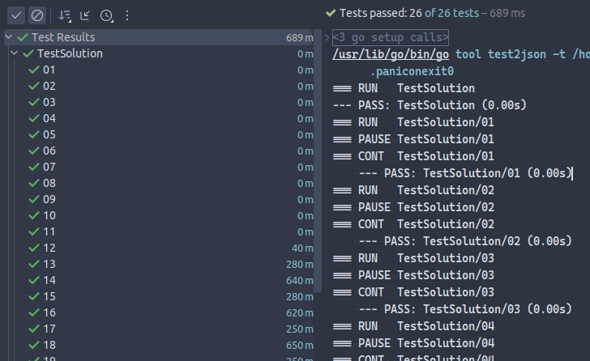

A package to ease testing of codeforces or any other online judge problems.
It allows you to run test on your code using test data located in files, where files with names like `01` contains test input and `01.a` contains test output.

## Installation

```bash
go get github.com/zenwarr/codeforces
```

## Usage

If your solution lives in `main.go`, you test data files should be located in directory `testdata`.

`main.go` should have the following structure:

```go
// this function contains your solution
func solve(in *bufio.Reader, out *bufio.Writer) {
	// your solution code here
}

// this function is going to be called in real codeforces environment
func main() {
	in := bufio.NewReader(os.Stdin)
	out := bufio.NewWriter(os.Stdout)
	defer out.Flush()

	solve(in, out)
}
```

Now create `main_test.go` file and write something like this:

```go
package main

import (
    "testing"
    "github.com/zenwarr/codeforces"
)

func TestSolution(t *testing.T) {
    codeforces.Test(t, solve) // pass your solve function here
}
```

Then you can run tests using `go test` command.
Make sure `testdata` directory is in current working directory, so it can be accessed by tests.

If running in IDEA, you can see test results and execution time in `Run` tab like this:



`Test` function is going to scan all files in `testdata` directory and run a test for your solution on each test case.
In each test, the entire output of your solve function is going to be compared with a corresponding `.a` file contents.

## Run a single test

You can run a single test case by specifying its number in `Test` function:

```go
func TestSolution(t *testing.T) {
    codeforces.TestFile(t, "01", solve) // run only "01" test case
}
```

## Custom line comparator

Some test cases contain only one variant of the correct answer, but the judge is going to accept other variants as well.

For example, in a hypothetical problem you need to check some condition and output a number divisible by 2 if the condition is true and any odd number otherwise.
In this case we need to check that all matching lines in your answer and `.a` file are either even or odd.

You can write something like this:

```go
func TestSolution(t *testing.T) {
    codeforces.TestWithLineComparator(t, solve, func(expected, actual string) bool {
		// check both values are odd or even
		expectedNum, err := strconv.Atoi(expected)
		if err != nil {
		    return false
		}

		actualNum, err := strconv.Atoi(actual)
		if err != nil {
		    return false
		}
		
		return expectedNum%2 == actualNum%2
    })
}
```

Each line in the test case is going to be checked against the corresponding line in `.a` file using this comparator, and the test is going to fail if the comparator returns `false` for any line.

The comparator does not know anything about internal structure of the output, so it is only usable for tests which can be compared line-by-line using the same condition.
